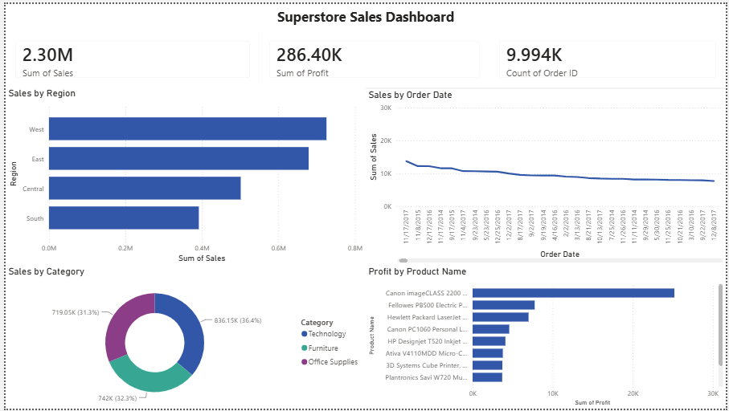

# 📊 Superstore Sales Dashboard — Power BI

A comprehensive business intelligence dashboard built in Power BI to analyze
retail sales performance across regions, categories, and products.

---

## 🖼️ Dashboard Preview

---

## 📌 Project Objective

To analyze 4 years of retail sales data from a US-based superstore and extract
actionable business insights around revenue, profitability, and product performance
using interactive visualizations.

---

## 📂 Dataset

| Detail | Info |
|--------|------|
| Source | [Kaggle - Superstore Dataset](https://www.kaggle.com/datasets/vivek468/superstore-dataset-final) |
| Records | 9,994 orders |
| Period | 2014 – 2017 |
| Fields | Order Date, Region, Category, Product, Sales, Profit, Quantity, Discount |

---

## 📈 Key Metrics

| Metric | Value |
|--------|-------|
| 💰 Total Sales | $2.30M |
| 📈 Total Profit | $286.40K |
| 🛒 Total Orders | 9,994 |
| 🏆 Top Region | West |
| 🥇 Best Category | Technology |

---

## 🔍 Dashboard Visuals

### 1. KPI Cards
Three headline cards showing Total Sales, Total Profit, and Total Orders —
giving an instant snapshot of overall business performance.

### 2. Sales by Region
Horizontal bar chart comparing sales across West, East, Central, and South
regions. West leads with the highest revenue.

### 3. Sales Trend Over Time
Line chart showing sales movement across the full 2014–2017 period, helping
identify seasonal patterns and growth trends.

### 4. Sales by Category
Donut chart breaking down revenue across three product categories:
- 🔵 Technology — 36.4% ($836K)
- 🟣 Furniture — 32.3% ($742K)
- 🟢 Office Supplies — 31.3% ($719K)

### 5. Top 10 Products by Profit
Horizontal bar chart ranking the 10 most profitable individual products.
Canon imageCLASS 2200 leads as the highest profit-generating product.

---

## 💡 Key Insights

- **West region** generates the highest sales among all 4 regions
- **Technology** is the most revenue-generating category
- **Canon imageCLASS 2200** is the single most profitable product
- Sales show a **declining trend over time** — warrants further investigation
- **Office Supplies and Furniture** have similar revenue share (~32% each)

---

## 🛠️ Tools & Skills Used

| Tool | Purpose |
|------|---------|
| Power BI Desktop | Dashboard creation & visualizations |
| Power Query | Data loading and transformation |
| DAX (Basic) | KPI measures |
| CSV / Excel | Raw data format |

---

## 📁 Files in this Repository

| File | Description |
|------|-------------|
| `Superstore_Dashboard.pbix` | Power BI project file |
| `superstore-sales-dashboard.png` | Dashboard screenshot |
| `README.md` | Project documentation |

---

## 🚀 How to Open

1. Download `Superstore_Dashboard.pbix`
2. Open with [Power BI Desktop](https://powerbi.microsoft.com/desktop)
   (free download)
3. Explore the interactive dashboard

---

*Built by Yash Fulsundar — Computer Science Undergraduate, GH Raisoni College*
